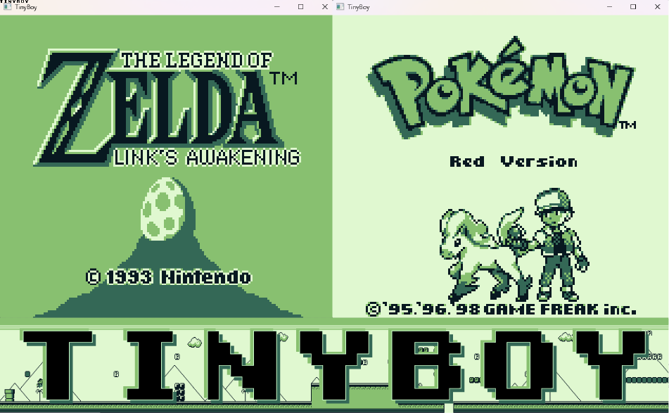

# TinyBoy - GameBoy Emulator

This project is yet another GameBoy emulator written in C++. The window, graphics and input were handled using SFML. 
The code was only tested on Windows, but should work on other platforms.


## Build & Run Instructions
You can build the project as follows:

```
git clone https://github.com/g-gisbert/TinyBoy.git
cd TinyBoy
mkdir build
cd build
cmake ..
make -j8
```

The ROM files are easily found online. To run the emulator, you just need to type :
```
./emulator [path/to/rom]
```

The buttons are mapped to A, B, enter (start) and delete (select).

## Features
Available:
- All 256 CPU instructions (+256 extended instructions)
- Successfully pass all Blargg's GameBoy CPU tests
- Handle no MBC, MBC1 and MBC3 cartridges

TODO:
- Audio
- GameBoy Color


## References
- [General GameBoy information (must read)](https://gbdev.io/pandocs/About.html)
- [GameBoy Opcodes](https://www.pastraiser.com/cpu/gameboy/gameboy_opcodes.html)
- [GameBoy Opcode Summary](https://www.devrs.com/gb/files/opcodes.html)
- [Game Boy: Complete Technical Reference](https://gekkio.fi/files/gb-docs/gbctr.pdf)
- [The Cycle-Accurate Game Boy Docs](https://github.com/geaz/emu-gameboy/blob/master/docs/The%20Cycle-Accurate%20Game%20Boy%20Docs.pdf)
- [GameBoy Doctor (amazing tool for CPU debugging)](https://robertheaton.com/gameboy-doctor/)